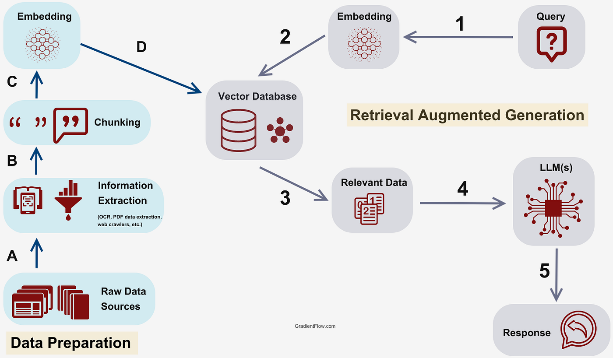

# AI 2 GenAI

This document outlines a series of topics designed to understand key concepts in Machine Learning and Artificial Intelligence, with a focus on Large Language Models (LLMs) and their practical applications and governance.

**AI CheatSheet**

**Appendix**:
1. [Introduction to Machine Learning Models & Architectures](#introduction-to-machine-learning-models--architectures) 
    
    a. [Machine Learning Concepts](#1-machine-learning-concepts)

    b. [Supervised Learning](#2-supervised-learning)

    c. [Unsupervised Learning](#3-unsupervised-learning)

    d. [Common ML Algorithms](#4-common-machine-learning-algorithms)

    e. [ML Life Cycle](#5-ml-life-cycle)

    f. [Limitations](#6-limitations-of-ml-models)

2. [Deep Dive into Neural Networks, Transformers & LLM Architectures](#deep-dive-into-neural-networks-transformers--llm-architectures)
    
    a. [Neural Networks](#1-transition-to-deep-learning--neural-networks)
    - [Limitaitons](#deep-learning-models-limitations)

    b. [Transformers](#2-transformers-the-core-of-modern-ai)
    
    c. [LLM Architectures](#3-llm-architectures)
    - [Limitations](#generative-ai-genai-limitations-including-llms)
    

3. [Prompt Engineering, RAG & Agentic AI](#prompt-engineering-rag--agentic-ai)
4. [AI Governance, Risks, & Data Security](#ai-governance-risks--data-security)

---
## Introduction to Machine Learning Models & Architectures

### Overview
This session introduces fundamental machine learning concepts, distinguishing between different learning paradigms and common problem types.

### Content

#### 1. Machine Learning Concepts
*   **Supervised Learning:**
    *   **Definition**: Learning from *labeled data* (input-output pairs) where the correct output is known for each input. The model learns a mapping function from inputs to outputs based on this historical data.
    *   **Analogy**: Teaching a child to identify fruits by showing them an apple and saying "apple," then showing an orange and saying "orange." The child learns to associate the visual characteristics with the correct label.
    *   **Applications**: Image classification, spam detection, fraud detection, weather forecasting.

*   **Unsupervised Learning:**
    *   **Definition**: Discovering hidden patterns or intrinsic structures in *unlabeled data*. The goal is to model the underlying structure or distribution in the data to learn more about the data itself.
    *   **Analogy**: Letting a child explore a box of diverse toys and group them by shared attributes like shape, color, or texture, without any prior instruction on how to categorize them.
    *   **Applications**: Customer segmentation, anomaly detection, dimensionality reduction, recommendation systems.

*   **Reinforcement Learning (RL):**
    *   **Definition**: A type of machine learning where an "agent" learns to make decisions by interacting with an "environment" to achieve a specific goal, receiving "rewards" for desirable actions and "penalties" for undesirable ones.
    *   **Analogy**: Training a dog to perform tricks, where correct actions are rewarded with treats.
    *   **Applications**: Robotics, game playing, autonomous driving, resource management.

#### 2. Supervised Learning
*   **Classification:**
    *   **Definition**: Predicting a *discrete* or *categorical* outcome. The model assigns input data points to predefined classes or categories.
    *   **Goal**: Assign data points to predefined classes.
    *   **Example**: Classifying emails as spam or not spam (binary classification), identifying different types of animals in images (multi-class classification), or determining if a patient has a specific disease.

*   **Regression:**
    *   **Definition**: Predicting a *continuous numerical value*. The model learns the relationship between input features and a continuous output variable.
    *   **Goal**: Find the best-fitting line or curve to predict numerical outcomes.
    *   **Example**: Predicting house prices based on features like square footage and number of bedrooms, forecasting stock prices, or estimating the temperature based on various weather conditions.

#### 3. Unsupervised Learning
Unsupervised learning focuses on discovering hidden patterns and structures in data without explicit labels. Unlike supervised learning, there's no "correct" output to guide the learning process. Instead, these algorithms work by identifying relationships, similarities, and anomalies within the dataset itself.

*   **Clustering:**
    *   **Definition**: The task of grouping a set of objects in such a way that objects in the same group (called a cluster) are more similar to each other than to those in other groups.
    *   **Goal**: To discover natural groupings within data.
    *   **Example**: Segmenting customers based on purchasing behavior to tailor marketing strategies, or grouping similar documents in a large corpus.
    *   **Visual Example**:
        

*   **Dimensionality Reduction:**
    *   **Definition**: The process of reducing the number of random variables under consideration by obtaining a set of principal variables. It's often used to reduce the complexity of data for analysis, visualization, or to improve the performance of other machine learning algorithms.
    *   **Goal**: To simplify data while preserving as much meaningful variance as possible.
    *   **Example**: Reducing a dataset with hundreds of features to just a few key components for easier visualization or to speed up training of a supervised model.
    *   **Visual Example**:
        

*   **Anomaly Detection (Outlier Detection):**
    *   **Definition**: Identifying rare items, events, or observations which raise suspicions by differing significantly from the majority of the data.
    *   **Goal**: To find data points that do not conform to expected behavior.
    *   **Example**: Detecting fraudulent credit card transactions, identifying unusual network intrusions, or pinpointing defective products on an assembly line.

#### 4. Common Machine Learning Algorithms

[ML Algorithms](algorithms/ml/ReadMe.md)

#### 5. ML Life Cycle

#### 6. Limitations of ML Models
Traditional ML models often rely on well-defined features engineered by humans. Their limitations stem from this dependency and their approach to learning.

*   **Feature Engineering Dependency:**
    *   **Limitation:** ML models are only as good as the features they are fed. If key features are missing, irrelevant, or poorly represented, the model's performance will suffer significantly. This requires extensive domain expertise and manual effort.
    *   **Example:** A traditional ML model for predicting house prices might require manually inputting features like "number of bedrooms," "square footage," "zip code," etc. If the quality of these features is poor, or if crucial ones like "proximity to good schools" are omitted, the prediction accuracy will be limited.

*   **Scalability Issues with Complex Data:**
    *   **Limitation:** While ML can handle structured data well, it can struggle with unstructured or highly complex data (like raw text, images, or audio) without significant pre-processing and feature extraction, which can be cumbersome and computationally expensive.
    *   **Example:** Applying a traditional ML classifier to raw images would require manually designing algorithms to detect edges, shapes, and colors before feeding them into the classifier.

*   **Limited Ability to Understand Context and Nuance:**
    *   **Limitation:** Traditional ML models often operate on statistical patterns within the engineered features. They lack the deep contextual understanding and nuanced interpretation that can be crucial for tasks involving natural language or complex relationships.
    *   **Example:** A traditional ML model might struggle to differentiate between sarcasm and a genuine statement in text, as it might not capture the subtle contextual cues or sentiment shifts.

*   **Interpretability vs. Performance Trade-off:**
    *   **Limitation:** While some traditional ML models (like linear regression or decision trees) are highly interpretable, more powerful ones (like ensemble methods) can become "black boxes," making it difficult to understand *why* a particular prediction was made.
    *   **Example:** It's easy to understand how a decision tree arrives at a prediction based on a series of if-then rules. However, understanding the decision process of a Random Forest with thousands of trees can be very challenging.

---

## Deep Dive into Neural Networks, Transformers & LLM Architectures

### Overview
This section transitions into deep learning, focusing on the Transformer architecture, which is foundational to modern Large Language Models (LLMs), and exploring different LLM architectural patterns.

### Content

#### 1. Transition to Deep Learning & Neural Networks
*   **Deep Learning (DL):** A subset of machine learning that uses multi-layered artificial neural networks. The "deep" refers to the number of layers in the network. These networks learn intricate patterns from vast amounts of data, often without explicit programming for each specific pattern.

*   **Artificial Neural Networks (ANNs): The Foundation**

    
    *   **Concept:** Inspired by the human brain's structure, ANNs consist of interconnected "neurons" (nodes) organized in layers: an input layer, one or more hidden layers, and an output layer.
    *   **How they work:** Each neuron receives inputs, processes them with a mathematical function, and passes the output to subsequent neurons. The strength of these connections is determined by numerical values called **weights** and **biases**. During training, the network learns by iteratively adjusting these weights and biases to minimize prediction errors. This iterative adjustment process is primarily driven by **gradient descent** and **backpropagation**.
    *   **Analogy:** Imagine a factory assembly line where each station (neuron) processes raw materials (data) and sends them to the next station. The goal is to produce a final product (prediction) that is as accurate as possible, and the factory continuously fine-tunes each station's operation (adjusts weights and biases) to achieve this.
    *   **Use Cases:** Broad applications in classification, regression, and pattern recognition on structured and unstructured data.
    *   **Visual Explanation:**
        *   For a simple explanation: 📺 [Explained In A Minute: Neural Networks](https://www.youtube.com/watch?v=rEDzUT3ymw4)

    * **Playground**: [Train Neural Network](https://playground.tensorflow.org/#activation=tanh&batchSize=10&dataset=circle&regDataset=reg-plane&learningRate=0.03&regularizationRate=0&noise=0&networkShape=4,2&seed=0.33925&showTestData=false&discretize=false&percTrainData=50&x=true&y=true&xTimesY=false&xSquared=false&ySquared=false&cosX=false&sinX=false&cosY=false&sinY=false&collectStats=false&problem=classification&initZero=false&hideText=false)

    *   **Core Keywords in Deep Learning:**
        *   **Weights:**
            *   **Concept:** Numerical values associated with the connections between neurons. They represent the "strength" or "importance" of each input signal as it passes through the network. The network learns by continuously adjusting these weights during training.
            *   **Analogy:** Think of them as volume knobs on an audio mixer – they control how much of each input signal contributes to the next sound (output).
        *   **Biases:**
            *   **Concept:** An additional numerical value added to the weighted sum of inputs for each neuron. It allows the neuron to activate even if all its inputs are zero, or it shifts the activation function's output. It's like a baseline or a threshold.
            *   **Analogy:** A baseline setting on that same audio mixer, allowing you to set a minimum output level regardless of input volumes.
        *   **Loss Function (or Cost Function / Error Function):**
            *   **Concept:** A mathematical function that quantifies how well (or poorly) a model is performing. It measures the discrepancy between the model's predicted output and the actual true output. The goal of training is always to *minimize* this loss.
            *   **Analogy:** A "scorecard" where a lower score means the model is performing better. For a dartboard, the loss would be the distance from the bullseye.
        *   **Gradient:**
            *   **Concept:** In the context of deep learning, the gradient is a vector that indicates the direction of the steepest *increase* of the loss function with respect to the weights and biases.
            *   **Analogy:** If the loss function is a landscape, the gradient at a point tells you the direction a ball would roll *uphill* most steeply. To minimize loss, we want to go in the *opposite* direction.
        *   **Gradient Descent:**
            *   **Concept:** An iterative optimization algorithm used to find the minimum of a function (our loss function). It adjusts the model's parameters (weights and biases) in small steps, moving in the direction *opposite* to the gradient of the loss function. This gradually leads the model towards a state where its predictions are most accurate.
            *   **Analogy:** Imagine a blindfolded person trying to find the lowest point in a valley. They take small steps, always feeling which direction is downhill, and moving in that direction.
            *   **Visual Explanation:**
                
                
        *   **Backpropagation:**
            *   **Concept:** The core algorithm that efficiently calculates the gradients of the loss function with respect to all the weights and biases in the neural network. It works by propagating the error (the difference between predicted and actual output) backward from the output layer through the hidden layers, effectively distributing responsibility for the error across the network.
            *   **Analogy:** If you have an error in a complex calculation, backpropagation is like tracing backward through all the steps to figure out exactly which numbers contributed how much to that error, so you know how to adjust them.

*   **Specialized Neural Networks for Specific Data Types:**
    While general ANNs are powerful, certain data types benefit from specialized architectures:

    *   **A. Convolutional Neural Networks (CNNs) - Excelling with Spatial Data (Images)**
        
        *   **Concept:** CNNs are primarily designed for processing data with a grid-like topology, most notably images. They use "convolutional filters" (small matrices) that slide over the input data to detect local patterns (e.g., edges, textures, specific shapes).
        *   **How they work:** Layers of CNNs learn to identify hierarchical features: early layers might detect simple lines, while deeper layers combine these to recognize complex objects like faces or cars. This makes them highly effective for tasks where spatial relationships are crucial.
        *   **Analogy:** Think of a detective scanning an image, looking for specific clues (edges, corners). They don't need to look at the whole image at once, but rather focus on small areas, combine those findings, and eventually identify larger objects.
        *   **Use Cases:** Image classification (e.g., identifying cats vs. dogs), object detection (locating objects in an image), facial recognition, medical image analysis. While primarily for images, 1D CNNs can also be used for specific text tasks (e.g., sentiment analysis by detecting n-gram features).

    *   **B. Recurrent Neural Networks (RNNs) - Tackling Sequential Data (Text, Time Series)**
        
        *   **Concept:** Unlike ANNs or CNNs, RNNs are designed to process sequential data, where the order of information matters. They achieve this by having an internal "memory" that allows information to persist from one step of the sequence to the next.
        *   **How they work:** At each step in a sequence (e.g., processing a word in a sentence), an RNN takes the current input and combines it with its hidden state (the memory from the previous step). This allows it to learn dependencies across time or sequence positions.
        *   **Analogy:** Imagine reading a book. You don't just understand each word in isolation; your understanding of the current word is heavily influenced by the words you've already read. An RNN tries to mimic this "memory" of past information.
        *   **Use Cases:** Natural Language Processing (NLP) tasks like language modeling (predicting the next word), machine translation, speech recognition, and time series forecasting.
        *   **Limitations (Crucial for Transformer transition):**
            *   **Long-term Dependencies:** Standard RNNs struggle to remember information from far back in long sequences (the "vanishing gradient" problem), making it hard to capture very long-range relationships.
            *   **Sequential Processing:** Their inherent sequential nature means they process one step at a time, making them slow and difficult to parallelize on modern hardware.
        *   **Visual Explanation:**
            *   For a clear conceptual understanding: [Recurrent Neural Network Tutorial IBM](https://www.ibm.com/cloud/blog/recurrent-neural-networks-tutorial)

*   **The Need for Transformers:**
    While RNNs were a breakthrough for sequential data, their limitations, particularly with long-term dependencies and parallel processing, paved the way for a revolutionary new architecture: the Transformer. The Transformer, as we'll explore next, overcomes these challenges by entirely replacing the recurrent mechanism with a powerful "self-attention" mechanism.

##### Deep Learning Models Limitations

Deep Learning, by leveraging neural networks, overcomes some traditional ML limitations by automatically learning features. However, it introduces its own set of challenges.

*   **Data Hungriness:**
    *   **Limitation:** DL models, especially those with many layers, require enormous amounts of labeled data to train effectively. Insufficient data leads to poor generalization and overfitting.
    *   **Example:** Training a state-of-the-art image recognition model from scratch would require millions of labeled images.

*   **Computational Intensity & Resource Requirements:**
    *   **Limitation:** Training deep neural networks is computationally very expensive, requiring powerful hardware (GPUs, TPUs) and significant time. This can be a barrier to entry and high-cost for deployment.
    *   **Example:** Training a large language model like GPT-3 can take weeks or months on specialized supercomputers.

*   **"Black Box" Nature & Lack of Explainability (More Pronounced than some ML):**
    *   **Limitation:** While DL models can achieve incredible performance, their internal workings are often opaque. Understanding precisely *why* a specific decision was made is exceptionally difficult, making debugging and building trust challenging.
    *   **Example:** A DL model might accurately diagnose a disease from a medical image, but explaining the exact visual cues or reasoning behind that diagnosis to a doctor can be impossible.

*   **Susceptibility to Adversarial Attacks:**
    *   **Limitation:** DL models can be fooled by subtle, imperceptible changes to input data (adversarial examples) that cause them to make incorrect predictions with high confidence.
    *   **Example:** Slightly altering a few pixels in an image of a stop sign can cause a self-driving car's DL model to misclassify it as a speed limit sign.

*   **Catastrophic Forgetting:**
    *   **Limitation:** When a DL model is trained on a new task, it can often forget or degrade its performance on previously learned tasks, especially if the new data is very different.
    *   **Example:** A DL model trained to identify cats and dogs might, after being trained on birds, completely lose its ability to correctly identify cats.

#### 2. Transformers: The Core of Modern AI
*   **A Bit In-depth Architecture:**
    
    *   **Self-Attention Mechanism ("Attention is All You Need"):** This innovative mechanism allows the model to weigh the importance of different words in an input sequence relative to each other, capturing long-range dependencies and complex contextual relationships. It enables the model to focus on relevant parts of the input when processing each word.
    *   **Encoder-Decoder Structure (Original Transformer):** The original Transformer model consists of an encoder stack and a decoder stack. The encoder processes the input sequence (e.g., English sentence), and the decoder generates the output sequence (e.g., French translation) using both the encoder's output and previously generated decoder outputs.
    *   **Positional Encoding:** Since Transformers process words in parallel (unlike sequential RNNs), positional encodings are added to the input embeddings to inject information about the relative or absolute position of tokens in the sequence. This preserves the order of words.
    *   **Feed-Forward Networks:** Each layer in the encoder and decoder contains a position-wise fully connected feed-forward network, which applies a linear transformation to the output of the attention sub-layer.

*   **Visual Explanation:** For a detailed visual explanation of the Transformer architecture, refer to: [https://jalammar.github.io/illustrated-transformer/](https://jalammar.github.io/illustrated-transformer/)

#### 3. LLM Architectures
*   **Encoder-Only Models:**
    *   **Characteristics:** These models focus on understanding text by generating rich, contextualized embeddings for inputs. They are good at tasks where the goal is to extract information or classify text.
    *   **Examples:** BERT (Bidirectional Encoder Representations from Transformers), RoBERTa.
    *   **Use Cases:** Text classification, sentiment analysis, named entity recognition, question answering (where the answer is present in the text).
*   **Decoder-Only Models:**
    *   **Characteristics:** These models are designed for text generation, predicting the next word in a sequence based on previous words. They excel at creative writing, summarization, and dialogue.
    *   **Examples:** GPT (Generative Pre-trained Transformer) series (GPT-2, GPT-3, GPT-4), LLaMA, Mistral.
    *   **Use Cases:** Content creation, chatbots, code generation, summarization, creative writing.
*   **Encoder-Decoder Models:**
    *   **Characteristics:** These models combine the strengths of both encoders and decoders, making them suitable for sequence-to-sequence tasks where input and output sequences are distinct.
    *   **Examples:** T5 (Text-to-Text Transfer Transformer), BART, Pegasus.
    *   **Use Cases:** Machine translation, abstractive summarization (generating new summaries rather than just extracting sentences), dialogue systems, structured data generation.

##### Generative AI (GenAI) Limitations (including LLMs)

Generative AI, while revolutionary in creating new content, inherits many DL limitations and introduces its own unique set of challenges related to creativity, control, and alignment.

*   **Hallucinations & Factual Inaccuracy:**
    *   **Limitation:** GenAI models, particularly LLMs, can confidently generate plausible-sounding but factually incorrect, nonsensical, or fabricated information. They do not inherently "know" truth; they predict statistically probable sequences.
    *   **Example:** An LLM might confidently generate a detailed but entirely false historical event or cite a non-existent scientific paper.

*   **Bias Amplification and Propagation:**
    *   **Limitation:** Because GenAI models learn from vast amounts of internet data, they inevitably absorb and can amplify existing societal biases present in that data (e.g., gender, racial, or cultural stereotypes).
    *   **Example:** A text-to-image model might disproportionately depict certain professions with specific genders or ethnicities if the training data reflects those biases. An LLM might generate biased descriptions or recommendations.

*   **Lack of True Understanding, Common Sense, and Sentience:**
    *   **Limitation:** GenAI models are sophisticated pattern-matching machines; they don't possess genuine consciousness, common sense reasoning, or the ability to truly understand the world as humans do. Their "knowledge" is statistical.
    *   **Example:** An LLM can write a convincing poem about sadness but doesn't *feel* sadness. It might struggle with a common-sense physics problem that a child could solve.

*   **Controllability and Predictability:**
    *   **Limitation:** Guiding the output of GenAI models to be consistently safe, accurate, and aligned with specific requirements can be challenging. Prompt engineering helps, but it's not a foolproof solution for all scenarios.
    *   **Example:** While you can ask an LLM to "write a story about a happy dog," it can be hard to guarantee it will avoid any slightly negative undertones or unexpected turns if not carefully prompted and guarded.

*   **Ethical Concerns (Misinformation, Misuse, Copyright):**
    *   **Limitation:** The power of GenAI can be misused to create deepfakes, spread misinformation at scale, generate harmful content, or infringe on copyrights by producing outputs too similar to existing works.
    *   **Example:** Using an LLM to generate persuasive but false political propaganda or creating AI-generated art that closely mimics a living artist's style without permission.

*   **Context Window Limitations (Still Relevant):**
    *   **Limitation:** Even with larger context windows, GenAI models have finite memory. They can still lose track of information in very long conversations or extremely large documents, impacting coherence and accuracy.
    *   **Example:** An LLM might forget earlier details of a complex, multi-turn dialogue or fail to synthesize information from a very long research paper if it exceeds its processing capacity.

---

## Prompt Engineering, RAG, & Agentic AI

### Overview
This section covers how LLMs can be augmented for more accurate and relevant responses (RAG), the art of crafting effective prompts, and the emerging field of Agentic AI.

### Content

#### 1. Prompt Engineering
*   **Definition:** Prompt engineering is the discipline of designing, refining, and optimizing the inputs (prompts) given to Large Language Models to guide their behavior and elicit desired, high-quality, and relevant outputs.
*   **Key Principles & Techniques:**
    *   **Clarity & Specificity:** Clearly state the task, desired output format, and any constraints. Avoid ambiguity.
    *   **Role-Playing:** Instruct the LLM to adopt a specific persona (e.g., "Act as a financial analyst," "You are a customer support agent").
    *   **Few-Shot Learning:** Provide one or more examples of input-output pairs within the prompt to demonstrate the desired pattern, style, or format.
    *   **Chain-of-Thought Prompting:** Encourage the model to break down complex problems into intermediate steps, showing its reasoning process before providing the final answer. This improves accuracy for complex queries.
    *   **Output Format Specification:** Explicitly ask for output in JSON, bullet points, markdown, etc.
    *   **Temperature & Top-P:** Parameters that control the randomness and diversity of the model's output. Lower temperature leads to more deterministic outputs, higher to more creative ones.
*   **Reference Link:** 
    -  Tina Huang's AI Prompt Guide: [Prompt Guide](https://paltech0.sharepoint.com/sites/AIAdoption/SitePages/AI-Concepts.aspx#prompt-engineering)
    - Prompt Engineering Guide - (https://github.com/dair-ai/Prompt-Engineering-Guide)

#### 2. Retrieval Augmented Generation (RAG)

*   **The Problem:** Large Language Models, while powerful, can sometimes "hallucinate" (generate factually incorrect information) or lack up-to-date knowledge beyond their training data cutoff.
*   **RAG Solution:** Retrieval Augmented Generation (RAG) is a technique that enhances LLMs by integrating them with external, up-to-date, and authoritative knowledge bases. Instead of solely relying on their internal parameters, LLMs can retrieve relevant information before generating a response.
*   **Key Components:**
    *   **Vectors & Embeddings:** Text (documents, queries) is converted into numerical representations called embeddings. These embeddings capture the semantic meaning of the text, allowing for similarity comparisons.
    *   **Vector Database:** A specialized database designed to efficiently store and search these high-dimensional vector embeddings, quickly finding semantically similar documents.
    *   **Process:**
        1.  **User Query:** A user submits a query to the RAG system.
        2.  **Embedding Generation:** The query is converted into a vector embedding.
        3.  **Retrieval:** The vector database is queried to find document chunks whose embeddings are most similar to the query's embedding.
        4.  **Context Augmentation:** The retrieved relevant document chunks are then passed along with the original query to the LLM as additional context.
        5.  **Augmented Generation:** The LLM generates a response, *augmented* by the provided factual context, reducing hallucinations and providing more accurate, relevant, and traceable answers.
*   **Hugging Face Platform:** A prominent open-source platform providing a vast repository of pre-trained models (including many for embeddings and LLMs), datasets, and tools that facilitate the development and deployment of NLP and RAG applications.

#### 3. Agentic AI

*   **Definition:** Agentic AI refers to AI systems, often powered by LLMs, that can autonomously reason, plan, and execute multi-step tasks by interacting with tools and environments. They can break down complex goals into sub-tasks and decide which actions to take.
*   **Key Characteristics:**
    *   **Reasoning:** The ability to logically process information and determine the best approach to achieve a goal.
    *   **Planning:** Creating a sequence of actions or steps to accomplish a task.
    *   **Tool Use:** Integrating with and utilizing external tools (e.g., search engines, code interpreters, APIs, databases) to gather information or perform specific operations.
    *   **Memory:** Retaining information from past interactions and experiences to inform future actions and learn over time (short-term and long-term memory).
    *   **Self-Correction/Reflection:** The capacity to evaluate their own progress, identify errors, and adjust their plans accordingly.
*   **How they work:** An LLM typically serves as the central "brain" of the agent, responsible for interpreting the user's goal, planning steps, deciding which tools to use, and integrating the results. This often involves a "thought-action-observation" loop.
*   **Reference Link:** A good starting point for understanding agents and their capabilities can be found in discussions around frameworks like LangChain or concepts like ReAct: [https://www.latent.space/p/llm-agents](https://www.latent.space/p/llm-agents)

##### 3A. MCP - Model Context Protocol

Give AI agents a consistent way to connect with tools, services, and data — no matter where they live or how they’re built.

Before MCP vs After

Traditional APIs vs MCP

Ref. Link: [🧑🏻‍💻 MCP Explained](https://medium.com/@elisowski/mcp-explained-the-new-standard-connecting-ai-to-everything-79c5a1c98288)

##### 3B. Google A2A

Let’s say you’re building a multi-agent system to summarize breaking news and publish digestible updates across multiple platforms. You’ve got a fleet of AI agents, each with its own specialty:

- **Agent A (News Scraper + Search Tool)**: Scans multiple RSS feeds, indexed news APIs, and even open web content for trending headlines and stories. It performs semantic search and keyword extraction to detect breaking news.
- **Agent B (Summarizer)**: Takes raw article content, strips out boilerplate, and uses a transformer-based model (like T5 or GPT) to generate concise summaries, optimized for mobile reading or Twitter threads.
- **Agent C (Distribution Manager)**: Decides how to format and publish the summaries to various platforms like email newsletters, social media, or in-app notifications, based on audience segmentation and past engagement data.

Here’s the challenge: these agents are great at what they do, but they don’t naturally **speak the same language.**

**Enter Google’s A2A Protocol.**

With A2A, each agent follows a **shared schema** and messaging flow.
So instead of Agent A throwing raw data over the wall and hoping for the best:

- Agent A emits a NewStoryDetected message with fields like title, source, content, and tags.
- Agent B listens for this message type and knows exactly how to parse it—thanks to the A2A spec. It replies with a StorySummaryReady event containing a human-readable summary, along with estimated reading time, tone analysis, and compression score.
- Agent C is subscribed to StorySummaryReady events and checks publishing rules. It responds with a DistributionAction event that triggers publishing across the correct channels, with minimal code orchestration needed.

Instead of custom APIs and glue code between every component, the A2A Protocol acts as the universal handshake—a shared language that keeps the entire pipeline clean, modular, and scalable.

Ref. Link: [🤖 Google's A2A](https://learnopencv.com/googles-a2a-protocol-heres-what-you-need-to-know/)

---

## AI Governance, Risks, & Data Security

### Overview
This concluding section addresses the critical aspects of responsible AI deployment, focusing on limitations, risks, guardrails, and data security. Understanding these elements is crucial for Business Analysts to ensure ethical and safe AI adoption.

### Content

#### 1. AI & LLM Limitations
It's vital to understand what current AI, especially LLMs, *cannot* do or where they struggle:
*   **Hallucinations:** LLMs can generate factually incorrect, nonsensical, or misleading information while sounding highly confident. This is a significant challenge for reliability.
*   **Bias:** LLMs learn from vast datasets, which often reflect societal biases (e.g., gender, race, stereotypes). The models can perpetuate and amplify these biases in their outputs, leading to unfair or discriminatory results.
*   **Lack of Real-World Understanding/Common Sense:** LLMs excel at pattern recognition and language generation but do not possess genuine common sense, consciousness, or understanding of the physical world. Their knowledge is statistical, not experiential.
*   **Context Window Limitations:** While improving, LLMs have a finite "context window" (the amount of text they can process at once). This can limit their ability to maintain long, complex conversations or understand very lengthy documents.
*   **Compute & Cost:** Training and running large LLMs require immense computational resources (GPUs) and energy, leading to high operational costs and environmental impact.
*   **Lack of Recency:** The knowledge of a pre-trained LLM is typically limited to its last training data cutoff, meaning it won't know about very recent events or information unless augmented (e.g., with RAG).

#### 2. Guardrails & Risks
To mitigate limitations and prevent misuse, guardrails are essential.
*   **Guardrails:** Proactive mechanisms implemented to ensure LLMs operate within defined ethical, safety, and operational boundaries.
    *   **Content Filtering:** Implementing filters to prevent the generation of harmful, illegal, unethical, or inappropriate content (e.g., hate speech, violence, explicit material).
    *   **Fact-Checking Integration:** Connecting LLMs to verified knowledge bases or external tools for real-time factual verification to combat hallucinations.
    *   **Evasion Detection:** Developing sophisticated techniques to identify and mitigate "jailbreaking" attempts or other efforts to bypass safety measures.
    *   **Human-in-the-Loop:** Incorporating human oversight and review points, especially in high-stakes applications, to ensure outputs are appropriate and accurate.
    *   **Steering & Control:** Providing ways to guide model behavior and prevent unintended responses.
*   **Risks:**
    *   **Misinformation & Disinformation:** The potential for LLMs to generate and spread false information at scale.
    *   **Privacy Violations:** Risk of exposing sensitive personal or proprietary data if models are trained on or process such information without proper safeguards.
    *   **Copyright Infringement:** Concerns about models generating content that infringes on existing copyrights, especially if trained on copyrighted material.
    *   **Job Displacement:** The potential for AI automation to impact human roles across various industries.
    *   **Algorithmic Discrimination:** Unfair or biased treatment of individuals or groups due to inherent biases in the training data or model design.
    *   **Security Vulnerabilities:** LLMs themselves can be targets of attacks or exploited for malicious purposes.

#### 3. Data Masking & Jailbreaking
These are specific techniques related to data security and model safety.
*   **Data Masking:**
    *   **Definition:** A data security technique where sensitive, real data is replaced with structurally similar but inauthentic data. The masked data retains its realistic appearance and format, making it suitable for development, testing, training, or analysis environments, without exposing actual sensitive information.
    *   **Techniques:**
        *   **Substitution:** Replacing real values with random but contextually appropriate values (e.g., replacing real names with fictional names).
        *   **Shuffling:** Randomly reordering data within a column.
        *   **Encryption:** Using cryptographic methods to secure data.
        *   **Tokenization:** Replacing sensitive data elements with non-sensitive substitutes (tokens).
    *   **Importance:** Crucial for protecting PII (Personally Identifiable Information), intellectual property, and other confidential data when working with AI models, especially during development and testing phases where models might be exposed to sensitive data.

*   **Jailbreaking:**
    *   **Definition:** An adversarial technique used to circumvent the safety measures, ethical guidelines, or content policies programmed into an LLM, coaxing it to generate undesirable, harmful, or prohibited responses.
    *   **Methods:** This often involves crafting clever, deceptive, or manipulative prompts that exploit vulnerabilities in the model's safety alignment. Examples include role-play scenarios ("Act as a 'DAN' (Do Anything Now) model..."), encoding harmful requests, or indirect phrasing.
    *   **Implications:** A major security and ethical concern, requiring continuous research and robust guardrail development to prevent LLMs from being exploited for malicious purposes (e.g., generating illegal advice, harmful content, or promoting misinformation).

#### 4. AI Governance & Data Security
These are broader organizational and policy considerations.
*   **AI Governance:**
    *   **Definition:** The comprehensive framework of policies, processes, roles, and oversight structures put in place to ensure the responsible, ethical, transparent, and accountable development, deployment, and use of AI systems within an organization or society.
    *   **Key Areas:**
        *   **Transparency:** Understanding how AI models make decisions.
        *   **Accountability:** Establishing clear responsibility for AI system outcomes.
        *   **Fairness:** Ensuring AI systems do not perpetuate or amplify biases.
        *   **Privacy:** Protecting data used by and generated by AI.
        *   **Safety & Reliability:** Ensuring AI systems are robust and perform as intended without causing harm.
        *   **Ethical Guidelines:** Defining organizational values and principles for AI use.
    *   **Regulatory Landscape:** Awareness of emerging AI regulations and guidelines (e.g., EU AI Act, NIST AI Risk Management Framework, voluntary commitments) that organizations must comply with.

*   **Data Security:**
    *   **Definition:** The practices, measures, and technologies used to protect data from unauthorized access, corruption, or theft throughout its lifecycle. This applies to data used by and generated by AI systems.
    *   **Practices:**
        *   **Secure Data Storage:** Implementing robust security for data lakes, databases, and cloud storage where training and inference data reside.
        *   **Access Controls:** Restricting who can access data and models based on roles and necessity (Least Privilege).
        *   **Encryption:** Encrypting data both "in transit" (when moved across networks) and "at rest" (when stored).
        *   **Regular Security Audits & Penetration Testing:** Proactively identifying and addressing vulnerabilities in AI systems and data infrastructure.
        *   **Incident Response Plans:** Having protocols in place to react to and recover from data breaches or security incidents involving AI.
    *   **Interaction with AI:** Securing the massive datasets used for AI training, protecting sensitive model weights and intellectual property, and ensuring secure inference environments to prevent data leakage or model manipulation.
